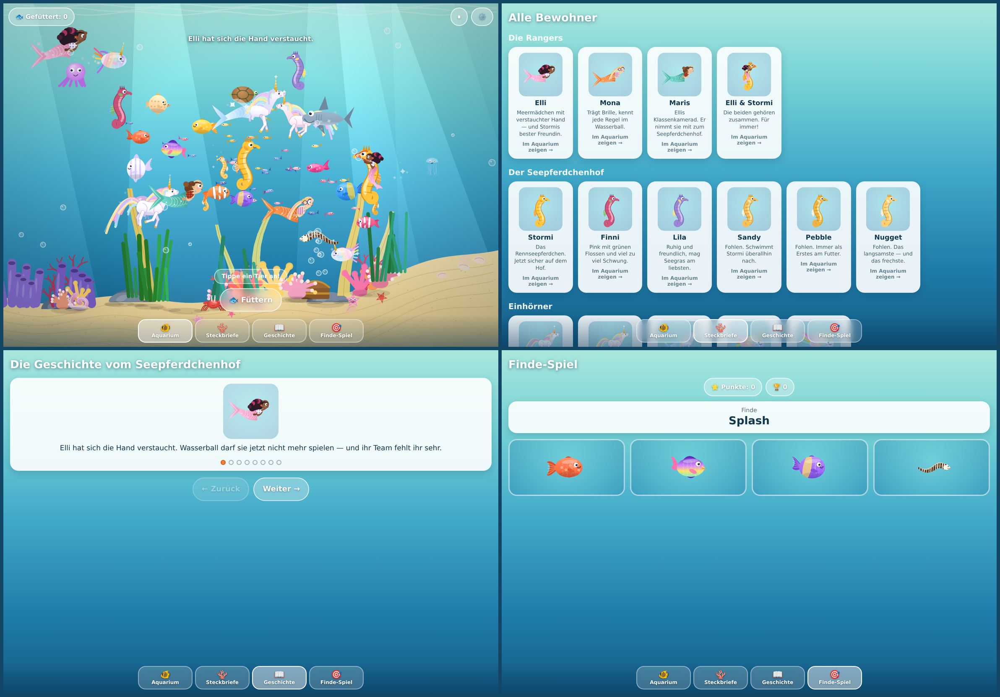

# Seepferdchen-Aquarium

An interactive aquarium for a five-year-old, set in the world of the
*Mein Seepferdchenhof* books. Every creature is drawn from scratch with the
Canvas 2D API — there are no images anywhere in the project.



## What's in it

**The tank** — around fifty creatures swimming under their own steam. Fish
chase food pellets, shoals move as one body and swarm a pellet together, the
seahorse foals follow Stormi wherever he goes, jellyfish drift upward, the crab
and the snail walk the sea floor. Tap the water to drop food; tap a creature and
it wiggles, tells you its name and bursts into sparkles.

**Steckbriefe** — a card for everyone who lives here, each with a live animated
portrait. Tapping a card jumps to the tank and makes that creature announce
itself. Creatures she has already met get a heart.

**Geschichte** — the story of Band 2 in eight short pages, each with the
character it is about.

**Finde-Spiel** — a name appears and four portraits; tap the right one. Wrong
answers are gentle, the best score is kept.

Settings cover language (German/English), sound, sparkles and a quality level
for older devices. Everything is stored locally; there is no backend and no
network traffic after the first load.

## Running it

```bash
npm install
npm run dev        # http://localhost:5173
npm run build      # static site in ./build
npm run preview    # serve the built site
npm test           # simulation unit tests
```

The build is a plain static site — drop `build/` on any web host, or open it
from a local server. A service worker caches everything on first visit, so once
it has loaded it works with no connection at all. Add it to the home screen on
iOS or Android and it opens fullscreen with no browser chrome.

## How it fits together

```
src/lib/
  art/           every drawing routine: creatures, reef, sea floor
    index.ts       ~2500 lines of Canvas 2D, bound to a context once
    extents.ts     bounding boxes, so portraits frame correctly
  sim/
    types.ts       the shapes the simulation passes around
    behaviour.ts   one movement routine per mode (swim, school, follow, …)
    world.ts       owns creatures and particles, steps and paints a frame
    world.test.ts  unit tests, run against a stubbed canvas context
  data/
    cast.ts        who lives in the tank, and what colour they are
    story.ts       the story pages and the ticker lines
    i18n.ts        German and English strings
  stores/          settings and progress, persisted to localStorage
  components/      Tank, CreaturePortrait, Nav, SettingsSheet
src/routes/        one route per section
```

The simulation is deliberately free of any framework: `World` takes a canvas
context and a list of creature specs, and exposes `step(dt)`, `draw()` and
`tap(x, y)`. That is what makes it testable in Node with nothing but a stub
context, and it keeps the Svelte components thin.

### Drawing

Creatures are drawn facing right, centred on the origin; the caller applies
position, facing and scale with a transform. Bodies are built from bezier and
arc paths with gradients, so everything stays crisp at any size and there is
nothing to download.

### Performance notes

- The canvas backing store is capped at ~3.2 megapixels, because an oversized
  canvas silently fails to allocate on iOS and renders as a blank rectangle.
- Creature size scales with the smaller screen dimension, and the shoals are
  thinned on narrow screens, so a phone shows a calm tank rather than a rush hour.
- The quality setting trades particle count for frame rate on older hardware.

## Credit

The characters — Elli, Mona, Maris, Stormi, Finni — come from
*Mein Seepferdchenhof* by Kathrin Lena Orso and Leonie Engel (Oetinger).
This is a personal, non-commercial fan project made for one small reader.
